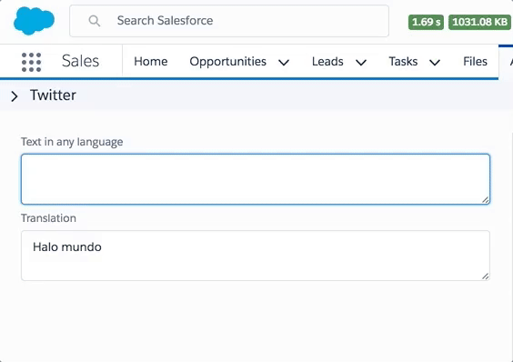

# lightning-translate
Translate text directly from Salesforce.

Component uses Google Cloud Translation API, but can also do entity 
analysis (find places, persons, things in text) or sentiment analysis (find 
  general tone of the text).
  
  [Click here for live demo](https://metacursion.github.io/lightning-translate/)
  
  
  
You will need to setup your API key. The one currently code only works from demo page.
[Get in touch if you need help setting up Google Cloud or Salesforce](https://metacursion.com)

